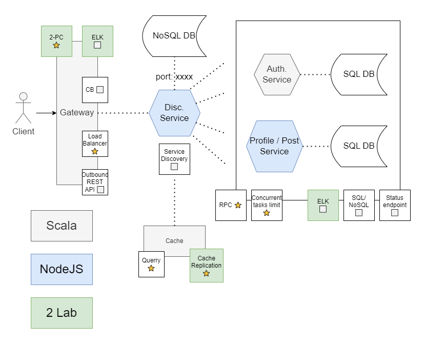

 # PAD Lab: Web Proxy & Logically Linked DBs

## Made by: Sorochin Nichita, FAF-191

### Navigation

- [Description](#description)
- [Main Components](#main-components)
    * [Gateway API](#gateway-api-scala--akka)
    - [Discovery Service](#discovery-service-nodejs)
    - [Authentication Service](#authentication-service-scala--akka)
    - [Post Service](#post-service-nodejs)
    - [Cache](#cache-scala--akka)
- [Docker](#docker)
- [System Diagram](#system-diagram)
- [Used Technologies](#used-technologies)

# Description

Microservice system designed as Instagram Clone. The primary interaction with client happens through the Gateway API, which has several REST API endpoints, communication between services is implemented using gRPC.

The system does now have security at all, during the developement there was scope to study about 
`Distibuted Sytems` and their common techniques and traits.

All the diagrams are located in `docs` folder.

# Main Components

- ## Gateway API (`Scala + Akka`)

The server, which is a bridge during users and microservices interaction. Forwards all the requests it has received forward and backwards.

## **Routes**

Gateway Service has several REST endpoints:

> ### All the request templates are located in `Microservice.postman_collection.json`, which you can import to you Postman App.

- ## `POST /status`:

Receives body as form-data with next template:

| Field | Value |
| :---: | :---: |
| service | <service_type>:<service_host>:<service_port> |

And then looks for the service in the system. If the service was found - sends its status, otherwise response that such server does not exists

Maybe later changed to GET request since its nature, just to transform received data template.

> **❗ Notice:** to receive Gateway Status, you need to put its gRPC port, not HTTP one!

- ## `GET /profile/%username%`:

Responds with profile information of corresponding user if exists; otherwise sends that such user does not exist.

- ## `GET /profile/%username%/%dozen%`:

Responds with corresponding dozen (argument is an integer) of profile posts information of corresponding if exists; otherwise sends that such user does not exist or sends empty list, if such dozen of posts does not exits.

- ## `POST /register`:

Receives one mandatory header `Authorization` which contains base64 encoded user data. Also, must have form-data body.

Template for this request:

### Headers:

| Header | Value |
| :---: | :---: |
| Authorization | <base64_encoded> |

### Body:

| Field | Value |
| :---: | :---: |
| name | <user_full_name> |
| photo | <user_avatar_path> |

- ## `GET /login`:

Receives one mandatory header `Authorization` which contains base64 encoded user data, which then can be used to receive unique hash key for user, which can be later used for authorized actions in the system. (Post upload, for instance)

Template for this request:

### Headers:

| Header | Value |
| :---: | :---: |
| Authorization | <base64_encoded> |

- ## `POST /upload`:

Receives one mandatory header `Key` which is the hash key received by requesting previous route, which then can be used for authorized actions, like uploading posts. Also, need to have body; both templates are presented below:

### Headers:

| Header | Value |
| :---: | :---: |
| Key | <hash_key> |

### Body:

| Field | Value |
| :---: | :---: |
| text  | <post_text> |
| photo | <post_photo_path> |

## **Features**

In the Gateway there was developed additional features:

### ⭐ **Cicruit Breaker**

If Gateway sends RPC call and Service does not respond the Gateway increments number of errror attached to this service. If the number of errors exceeds the limit - the service will be removed from the whole system until it will not send `Discover` call to the Discovery Service.

### ⭐ **Load Balancer**

When Gateway sends RPC call to the Service, it inceases `load` value attached to the service. After receiving respone or exception from the service call, the load of the service will be decreased. If there are several instances of one service type, the Gateway will make RPC call to the least loaded service.

### ⭐ **ELK Stack**

All the log data can be transmitted by TCP using log4j to Filebeat and used by ElasticSearch and Kibana. More information about ELK stack can be found [here](https://www.elastic.co/what-is/elk-stack).

### ⭐ **2 Phase Commit**

2 Phase Commit is used for the Registration route, because during this request both Authentication and Post services are used. So if one of them does not respond or denies request, whole request will be denied. More information about 2 Phase Commit and other Distributed Transaction Patterns can be found [here](https://developers.redhat.com/blog/2018/10/01/patterns-for-distributed-transactions-within-a-microservices-architecture).

## **(g)RPC**

To establish communication betnween all the services there was used gRPC protocol. All the protobuf files can be found in Service folders.

Located in the folder `Gateway`.

- ## Discovery Service (`NodeJS`)

The service with static port, which every other service are trying
to connect to. Contains all the data about state of services and gateways, and if other side is not connected to the system, it is considered as turned off. Connected to the MongoDB to persist all the services data.

Located in the folder `Discovery`.

- ## Authentication Service (`Scala + Akka`)

The service used for all the in-system actions related to authentication. Service is connected to the MySQL database (DB driver configurations are in configuration file, for example `/resources/application.conf`).

Located in the folder `Auth`.

- ## Post Service (`NodeJS`)

The service used to process and save all the Profile/Post data of the users. The services is also connected to the MySQL database.

  Located in the folder `Post`.

- ## Cache (`Scala + Akka`)

The services used to temporary contain data, which is often requeted from the Post service.

### ⭐ **Cache Replication**

The system support Leaderless Cache Replication System in order to distribute the workload to several Cache instances. When one instance of the cache receives data from the Gateway, it creates timestamp for this information, saves both information and timestamp, and after sends it the all other instances of the cache. If the instance of the cache receives the data from the other cahce, it checks if it already has such information, and if it has the least recent version, it ignores the data, otherwise saves it.

Located in the folder `Cache`.

# Docker

All the services can be dockerized, all the services projects are already configured for dockerization. Also, all services have two configuration files: one for Docker, and the other for ordinar run in IDE.

All the images can be build using `buildAll.sh` script.

After creating the images of all services, you have to run Docker Compose, which can also be made using `runCompose.sh` script.

Both scripts are located in general folder.

> **❗ IMPORTANT:** All the Config Files for dockerization are ready to run using Docker Compose, if you want to run the services separately without it, you should edit those Config Files.

# System Diagram

The following diagram is the schematic representation of whole system:

# Used Technologies

### **Scalla + Akka**

- ### Scala Language - 2.13.8

- ### Akka Library - 2.6.19

- ### Akka Http - 10.2.10

- ### Akka gRPC plugin - 2.1.6

- ### Log4j - 2.19.0

- ### MySQL Connector Java - 5.1.24

- ### Json4s - 4.1.0-M1

### **NodeJS**

 - ### gRPC-JS - 1.7.1

 - ### Proto Loader - 0.7.3

 - ### Express 4.18.1

 - ### MySQL2 (driver) - 2.3.3

 - ### MongoDB (driver) - 4.10